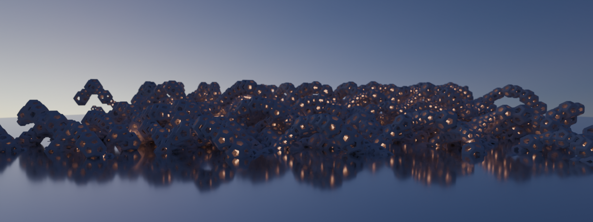
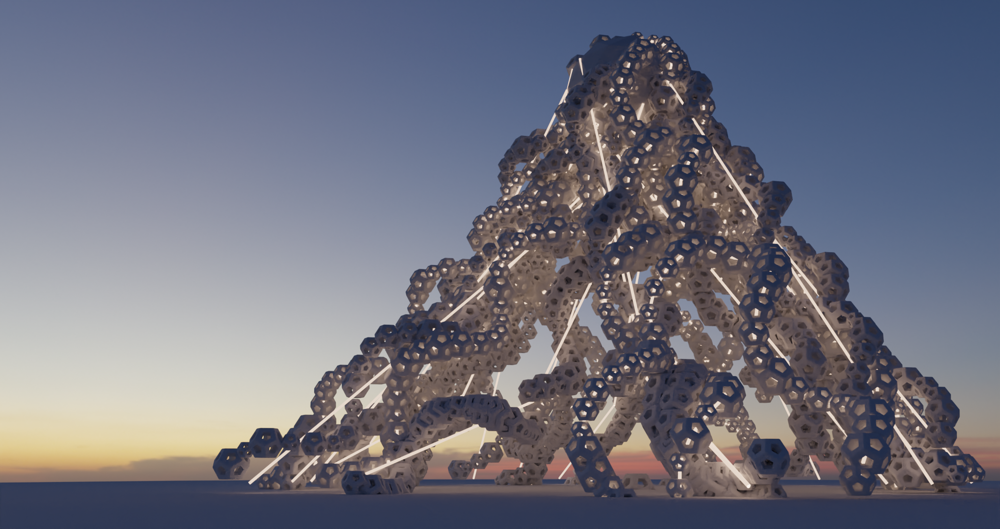
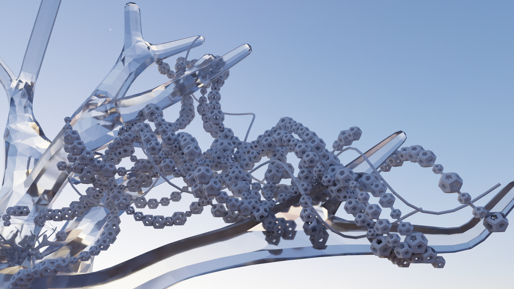
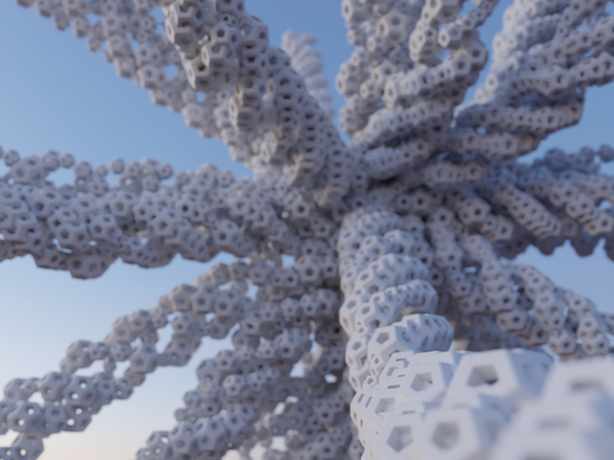
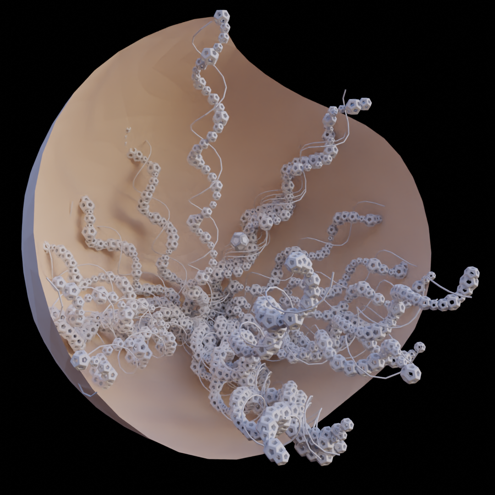
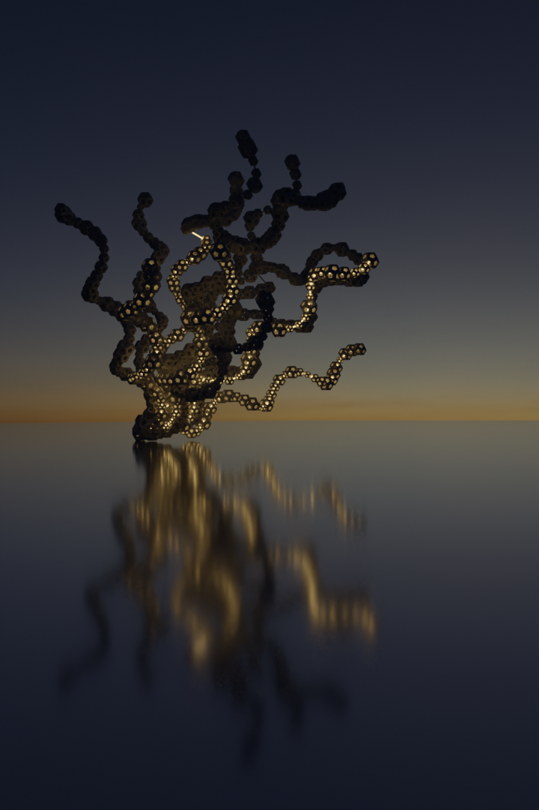
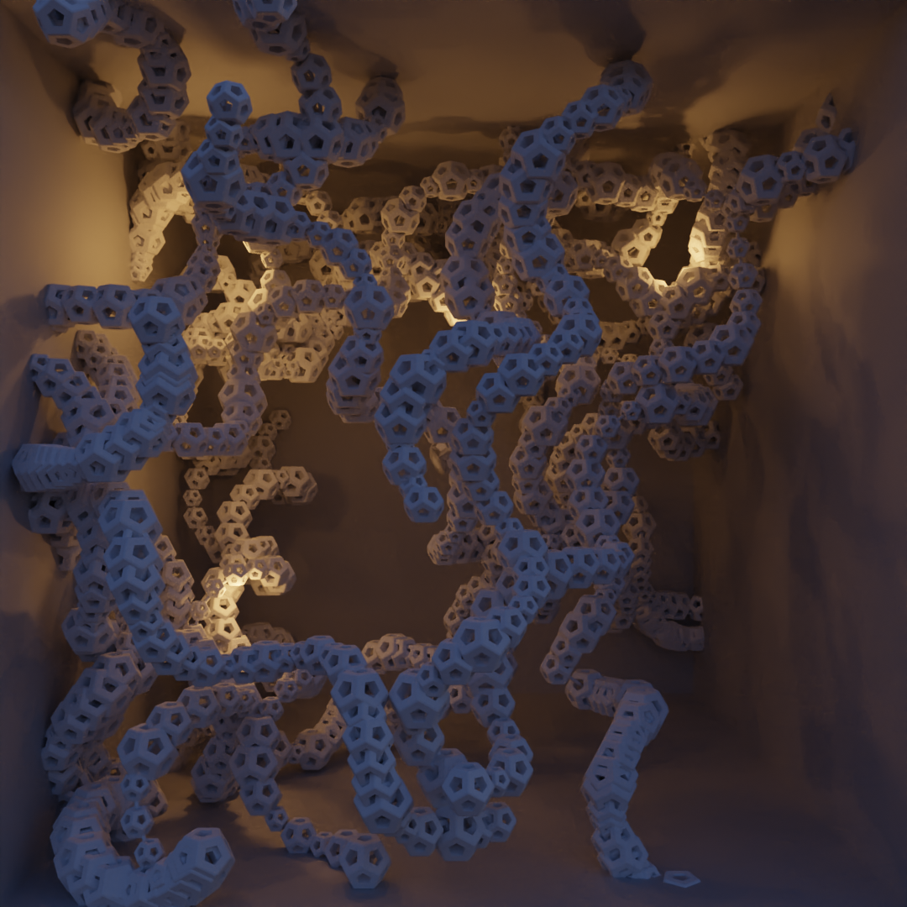

# Dodecahedron Paths

Generative art done using Blender Python API.

Code purpose is to artistically ehnance the environment 3D scene created by the user.

Code consists of:
1. Several algorithms for path construction through 3D space.
2. Enhancement of created paths through 3D space.
3. Creation and instancing of 3D objects on constructed paths.

Examples:

More examples on my ArtStation: https://www.artstation.com/lovro

Thanks to PolyHaven for fantastic HDRIs!
